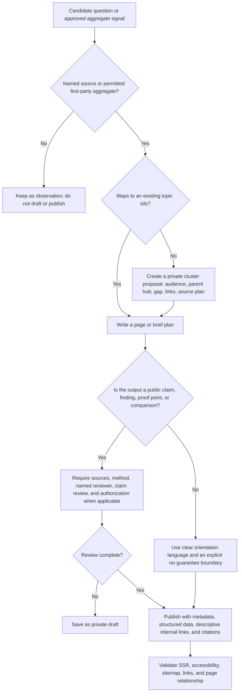

# Coreweaver Labs — Agent Operating Guide

This document is the **working agreement for every human or agent** contributing to Coreweaver Labs. It preserves continuity across research, design, engineering, publication, and operations. If a task conflicts with this guide, the lower-risk, reviewable option wins until a named owner records a decision.

## Start Here

Before changing a non-trivial feature, an agent must read `todo.md`, `HANDOFF.md`, this document, the relevant page or system files, and the current strategy record that governs the work. For content work, start with `content-hub-spoke-architecture.md`, `expanded-hub-spoke-content-map.md`, and `content-operations-foundation.md`. For claims or research, also read `presence-first-strategy.md`, `validation.md`, and the applicable source record.

## Non-Negotiable Rules

| Rule | Operational meaning |
|---|---|
| **Evidence before eloquence** | Do not publish findings, results, reviews, rankings, client claims, or comparisons without traceable support and the applicable review record. |
| **Draft-only automation** | Signals and scheduled work may create private briefs or drafts. They may not publish, email, post, change a public claim, or take another external action without a human review step. |
| **One clear entity** | Use the canonical Coreweaver Labs name, audience, service language, URLs, and terminology already established in the codebase. Do not improvise aliases or unsupported relationships. |
| **Links carry meaning** | Use crawlable HTML links with descriptive anchor text. Every new public page needs a parent, a relevant sibling or adjacent method page, and a path back to a conversion or research hub. |
| **Every public page has a job** | A page must answer a buyer question, support a topic cluster, strengthen a trusted entity record, or explain a method. Do not create orphan content for a keyword alone. |
| **Safety is a feature** | Private intake, drafts, source logs, and review queues stay private and noindexed. Never expose credentials, raw visitor data, private prompt context, or unapproved source materials. |

## Working Roles

| Role | Owns | Cannot do alone |
|---|---|---|
| Research agent | Source plan, evidence inventory, limitations, citation candidates | Publish a claim or treat a trend as proof |
| Content architect | Cluster intent, page role, internal-link plan, gap prioritization | Invent research outcomes or client proof |
| Drafting agent | Reader-first outline and draft language | Publish, cite a source it has not inspected, or remove caveats |
| Evidence reviewer | Source quality, claim wording, method note, limitation language | Substitute a generic citation for direct support |
| Technical publisher | Route, schema, metadata, canonical URL, sitemap, semantic links | Change private records into public evidence |
| Quality gate | Tests, SSR, accessibility, visual review, checklist, handoff | Waive material errors or safety controls |

## Collaboration Protocol

1. **Claim work.** Add a specific unchecked item to `todo.md` before implementation. Confirm the active scope and leave unrelated changes alone.
2. **Inspect before editing.** Read the existing route, data model, stylesheet, tests, and relevant strategy documents. Reuse existing components and vocabulary.
3. **Write the decision down.** When evidence, naming, scope, or architecture is ambiguous, record the lower-risk option in `owner-decisions.md` or the appropriate strategy file rather than silently guessing.
4. **Build in bounded units.** Keep public presentation, data contracts, private workflows, and scheduled operations separately testable.
5. **Validate the whole path.** Run focused tests, type checking, production build, SSR checks, and a responsive visual review. Confirm `todo.md` before a checkpoint.
6. **Checkpoint and hand off.** State what changed, what remains private or pending, the governing files, validation evidence, and the next smallest safe action.

## The Content Decision Tree

## Content Silo Method

Every content silo begins with a **buyer question**, not a keyword list. The minimum viable cluster is a hub, a page that goes one level deeper, a related evidence or method page, and a relevant service or next-step route. The public sequence is: explain the problem, clarify the decision, show the supportable operating method, name the evidence boundary, and offer a private next step.

| Content layer | Purpose | Required links |
|---|---|---|
| Hub | Organize one commercial or methodological territory | Links down to live spokes and across to one method/evidence hub |
| Child guide | Resolve one specific buyer decision | Parent hub, adjacent child/method page, Resources or research page, relevant service path |
| Insight or field brief | Explore a time-sensitive question or a controlled draft | Exactly one parent cluster and one deeper resource where meaningful |
| Research record | Explain a finding or method with accountable provenance | Source references, method note, reviewer, limitation language, relevant cluster |
| Proof record | Share authorized client evidence only | Source, scope, reporting window, review date, and written authorization |

## Citation Standard

Prefer primary documentation, public standards, original research, official datasets, and disclosed first-party methods. Cite the source that directly supports the sentence, place the citation near the claim, and describe limitations when a source is contextual rather than dispositive. A prestigious publication does not excuse an unsupported conclusion.

## Scheduled Trend-to-Draft Queue

The private queue is an editorial assistant, not a publisher. A named reviewer enters a minimized aggregate signal, documents its source contract and observation window, approves it, and the weekly job can create **at most one** private field-brief draft. The draft still needs source review, a method note, a named claim reviewer, and an explicit publication decision. No raw visitor input, unreviewed trend, or model output is treated as a public fact.

## Earthward Foundry Pathway

Earthward Foundry is an **exploratory future pathway**, not a claim of an existing service, entity relationship, or market position. New work may pave the way by making the operating system portable: stable entity language, documented source contracts, reusable review gates, modular topic silos, and clear ownership. Do not publish partnerships, products, credentials, funding, locations, customers, or performance statements for Earthward Foundry without a separate owner-approved record.
